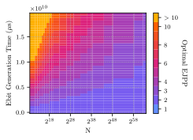

# Exploration of Design Alternatives for Reducing Idle Time in Shor’s Algorithm: A Study on Monolithic and Distributed Quantum Systems

This repository contains code to construct and evaluate monolithic and distributed quantum circuits for Shor's algorithm. Additionally, scripts are provided to reproduce the plots of [[1]](https://ieeexplore.ieee.org/document/11168277).



## Installation

We recommend running the code in a virtual environment. All code has been tested with Python 3.11 using the packages and versions in `requirements.txt`:

```pip install -r requirements.txt```

## Usage

The main scripts to compute the depth/runtime of different configurations of distributed circuits of Shor's algorithm are `distributed_shor/depth_experiments.py` and `distributed_shor/CU_experiments.py` to calculate the average depth of single CU  controlled arithmetic operations inside the algorithm. Different runtime weights are for multiple qubit technologies are provided in `distributed_shor/weight_utils.py`. Arbitrary numbers `N` up to 64 bit can be used as an input. We recommend making use of multiprocessing to compute the runtimes of different configurations in parallel. All the proposed designs form the paper for the standard and distributed logarithm approach are supported. Results will be stored by default in `out/results`.

```python3 -m distributed_shor.depth_experiments.py```

For plotting, `distributed_shor/depth_plots.py` provides utilities to generate different comparison plots for different configurations. By default, the plotting functions access the results of `depth_experiments.py` and `CU_experiments.py` from `out/results` for the provided set of design configurations. Plots are then provided in the corresponding subfolders.

```python3 -m distributed_shor.depth_plots.py```

## Attribution

If you want to cite this work, use the following:

```bibtex
@ARTICLE{11168277,
  author={Schmidt, Moritz and Kole, Abhoy and Wichette, Leon and Drechsler, Rolf and Kirchner, Frank and Mounzer, Elie},
  journal={IEEE Transactions on Quantum Engineering}, 
  title={Exploration of Design Alternatives for Reducing Idle Time in Shor's Algorithm: A Study on Monolithic and Distributed Quantum Systems}, 
  year={2025},
  volume={6},
  number={},
  pages={1-25},
  keywords={Qubit;Quantum computing;Registers;Hardware;Logic gates;Optimization;Arithmetic;Quantum circuit;Algorithm design and analysis;Distributed quantum computing (DQC);quantum circuit optimization;Shor's algorithm;static timing analysis (STA)},
  doi={10.1109/TQE.2025.3610800}}
```
